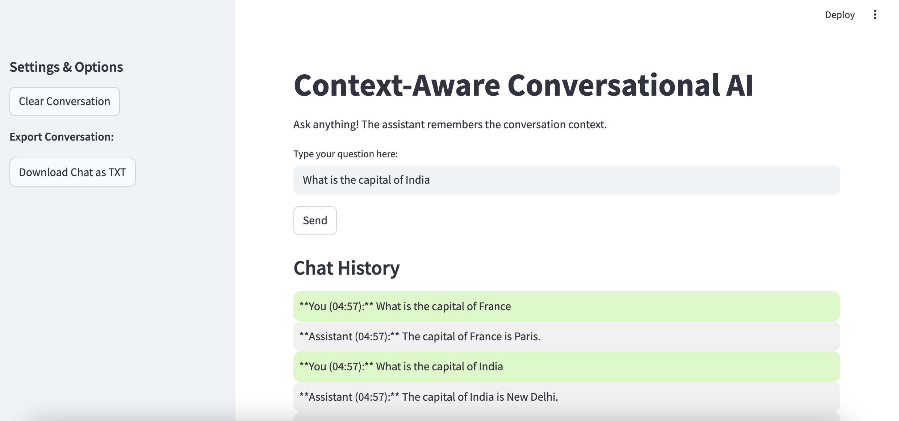

# Context-Aware-AI

A context-aware chatbot powered by Groq LLM (LLaMA 3) and LangChain. This app uses ConversationBufferMemory to remember the entire conversation history, allowing for a seamless, multi-turn chat experience.

### Users can

- ✅ Ask context-based questions
- ✅ Clear conversation memory anytime
- ✅ Download their entire chat history as a .txt file
- ✅ Experience a responsive, modern Streamlit UI

## 🖼️ Features

- 💬 Persistent Memory: Remembers entire conversation history.
- 🧹 Clear Conversation: Start fresh anytime with a single click.
- ⬇️ Download Chat: Export your entire conversation as a .txt file.
- 🎨 Clean UI: Chat bubbles for a messenger-like experience.
- ⚡ Powered by Groq: Lightning-fast inference with Groq’s LLaMA 3.

## 🛠️ Tech Stack

- **1. Streamlit**
  – For building the interactive web app.
- **2. LangChain**
  – For memory and chaining logic.
- **3. Groq**
  – For blazing-fast LLM inference.
- **4. Python 3.9+**
  – Core programming language.

## 📂 Project Structure

```
📦 conversational-ai-groq
 ┣ 📜 app.py             # Main Streamlit app
 ┣ 📜 requirements.txt   # Python dependencies
 ┣ 📜 .env               # Example environment variables
 ┗ 📜 README.md          # Project documentation
```

## ⚙️ Installation & Setup

### 1️⃣ Clone the Repository

```
git clone https://github.com/foram07/conversational-ai-groq.git
cd conversational-ai-groq
```

### 2️⃣ Create Virtual Environment

```
python -m venv venv
source venv/bin/activate  # On Mac/Linux
venv\Scripts\activate     # On Windows
```

### 3️⃣ Install Dependencies

```
pip install -r requirements.txt
```

### 4️⃣ Setup Environment Variables

Create a .env file in the project root and add your Groq API Key:

```
GROQ_API_KEY=your_groq_api_key_here
```

### 5️⃣ Run the App

```
streamlit run app.py
```

## 🎮 How to Use

- Enter your question in the input box and press Send.
- The assistant responds based on conversation history.
- Use the Clear Conversation button to reset memory.
- Click Download TXT to save your chat history.

## 🖼️ Demo Screenshot



## 🔥 Why This Project?

- Showcases LangChain’s ConversationBufferMemory.
- Demonstrates Groq LLaMA 3 integration for lightning-fast responses.
- Modern UI that’s resume-ready and production-friendly.

## Perfect for:

- 🚀 AI Chatbot Portfolio Project
- 🏢 Enterprise Knowledge Assistant
- 🧑‍💻 AI Developer Showcases

## 🚀 Deployment on Streamlit Cloud

This project is deployed on **Streamlit Cloud**, making it easy for anyone to view and use the app without installing dependencies locally.  

🔗 **Live App:** [Streamlit App](https://context-aware-ai-apps.streamlit.app/)

